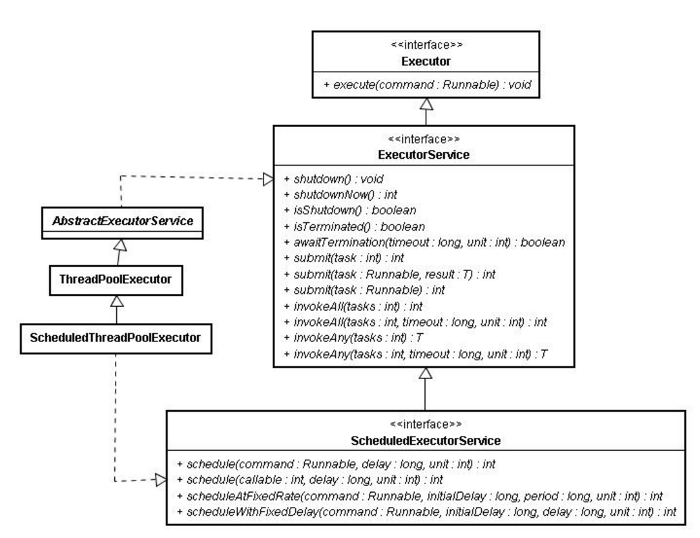

java线程池
---

一、线程池分类

按照线程池是否固定大小，可以将线程池分为一下两类：

1. 固定大小的线程池
	* newFixedThreadPool
	* newScheduledThreadPool（newFixedThreadPool的扩展，可以指定线程数，同时可以指定任务执行的起始时间和时间间隔）
	* newSingleThreadExecutor（也是newFixedThreadPool的特例，固定大小为1）
	
2. 不固定大小的线程池
	* newCachedThreadPool

二、创建线程池

通过Executors类创建ExecutorService.

ExecutorService相关类和接口关系：

