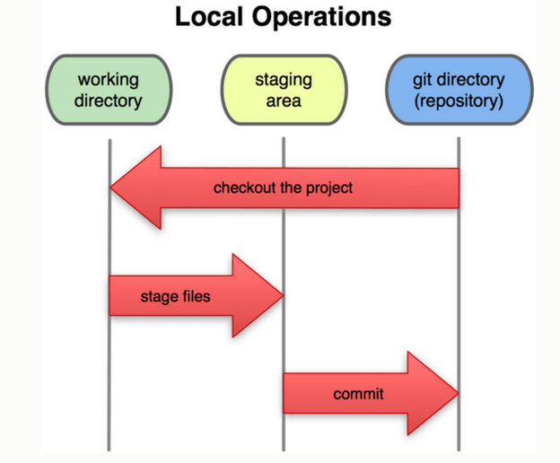

关于git版本控制协议一些粗浅的理解
---

>引用（即指针）对于理解git非常重要，git的分支、tag只是指向了不同commit的指针，不是实际文件.

>[常用git命令](./git-command.md)

###git版本控制协议结构图

###关于暂存区的理解

>1.图中index就是stage状态(暂存区)，index保存的是当前所有文件最新的git对象对应的hash值，使用commit命令后会将这些最新的状态提交到head中，head保存的就是该分支所有文件最新的状态，属于git仓库信息

>2.Git index 可以看作是工作目录和Git库目录之间的暂存区，commit已经是把修改作用于仓库了，只不过没有push到远程仓库
暂存区（stage或者叫index） 存储的是整个文件，如果文件修改add到暂存区，那么就会覆盖文件的上个版本，所以一定不会发生冲突

>3.切换分支前要把修改的未提交的内容提交，不然切换分之后修改内容在另一个分支上任然可见，这样提交的时候就会有不需要的内容被提交（stash可以解决这个问题）

	

