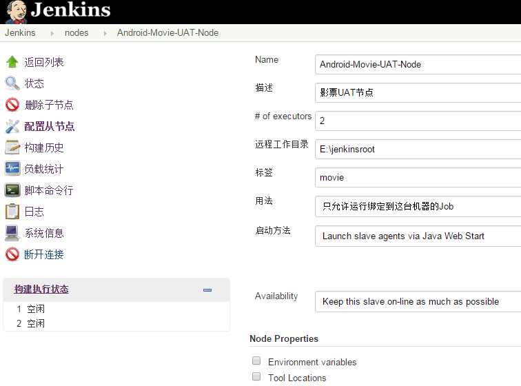
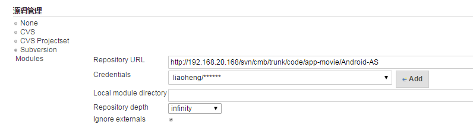
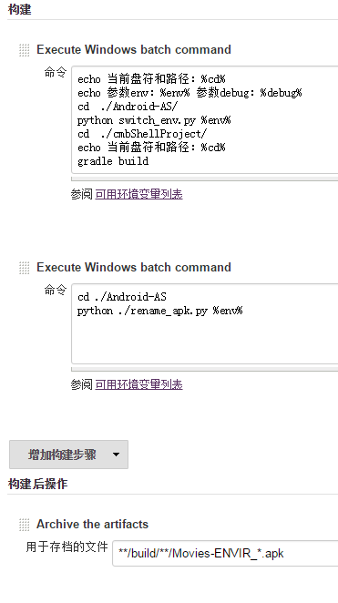

Android自动构建
---

	主机：jenkins服务器
	节点机：windows 7 64bit
	构建工具：gradle	

###一、搭建jenkins

jenkins本身是一个java服务端程序，可以直接在tomcat等服务器上运行。

###二、创建主机节点

安装好jenkins就可以配置节点啦。

配置如下

	说明：
	1、远程工作目录：节点机器的工作目录，用于同步版本管理的代码、生成目标文件（Android就是apk文件）
	2、标签（lable）：在创建构建任务时指定lable就能将任务绑定到指定节点

###三、启动jenkins节点（需先下载slave.jar）

创建jenkins节点后，节点显示是不可用的状态，这是在节点机器命令行上运行如下代码即可启动节点机器，完成节点机器和主机的通信：
`java -jar slave.jar -jnlpUrl http://192.168.20.168:8080/jenkins/computer/Android-Movie-UAT-Node/slave-agent.jnlp -secret ef17b121a06d6
c5f42cfd9e12b4c98b569d165e08f3d492381b90a0b2530f025`
	
	说明：密钥在通讯时验证，不同节点不同。

###四、配置节点机器的构建环境
	
1. 安装jdk，并在命令行配置java、javac等命令
2. 安装Android sdk，并配置android等命令
3. 安装gradle，并配置环境变量，这里使用的是`gradle 2.6`

###五、创建构建任务

配置的android-gradle-movies-uat如图

;
;

	说明
	1. Label指定运行的节点机器。
	2. 构建 栏目使用的是windows shell命令行，因为在安装gradle插件的时候安装失败，所以直接调用节点机器的命令行执行构建指令
	3. Archive the artifacts将生成的构建文件保存到主机服务器，从而在构建成功后可以在jenkins服务器下载。
	4. 代码放在svn，最好是主工程和子工程放在一个目录下面，并且代码中的sdk路径配置需要和执行构建任务机器的sdk路径相同，不然会找不到sdk导致构建失败。

###六、执行构建，获得构建结果

构建成功后可以在**状态**栏看到：

 