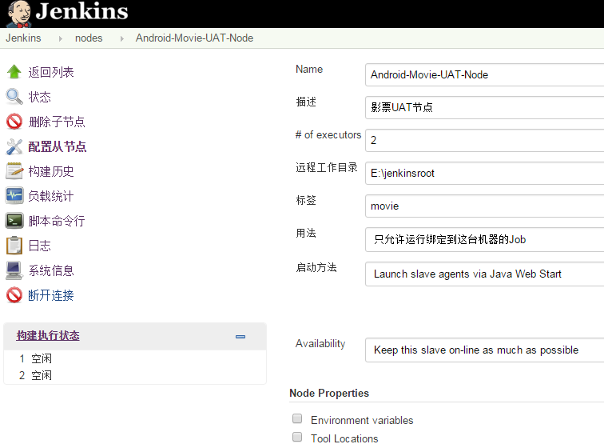
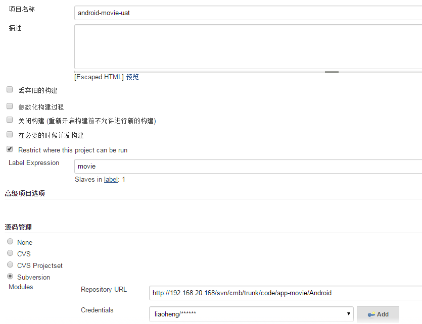
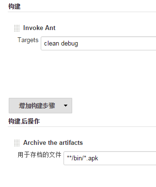
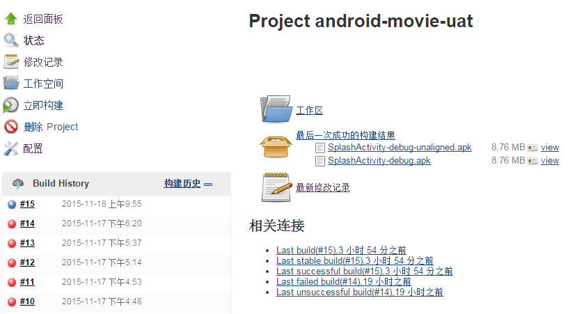

本文以分布式jenkins节点为运行环境介绍jenkins构建Android的步骤
---
###一、搭建jenkins

jenkins本身是一个java服务端程序，可以直接在tomcat等服务器上运行。

###二、创建主机节点

安装好jenkins就可以配置节点啦。

配置如下

	说明：
	1、远程工作目录：节点机器的工作目录，用于同步版本管理的代码、生成目标文件（Android就是apk文件）
	2、标签（lable）：在创建构建任务时指定lable就能将任务绑定到指定节点

###三、启动jenkins节点代码（需先下载slave.jar）

创建jenkins节点后，节点显示是不可用的状态，这是在节点机器命令行上运行如下代码即可启动节点机器，完成节点机器和主机的通信：
`java -jar slave.jar -jnlpUrl http://192.168.20.168:808
0/jenkins/computer/Android-Movie-UAT-Node/slave-agent.jnlp -secret ef17b121a06d6
c5f42cfd9e12b4c98b569d165e08f3d492381b90a0b2530f025`
	
	说明：密钥在通讯时验证，不同节点不同。

###四、配置节点机器的构建环境
	
1. 安装jdk，并在命令行配置java、javac等命令
2. 安装Android sdk，并配置android等命令
3. 安装ant，并配置环境变量

###五、创建构建任务

配置的android-movie-uat如图

	说明
	1. Label指定运行的节点机器。
	2. Archive the artifacts将生成的构建文件保存到主机服务器，从而在构建成功后可以在jenkins服务器下载。

###六、执行构建，获得构建结果

构建成功后可以在**状态**栏看到：

 