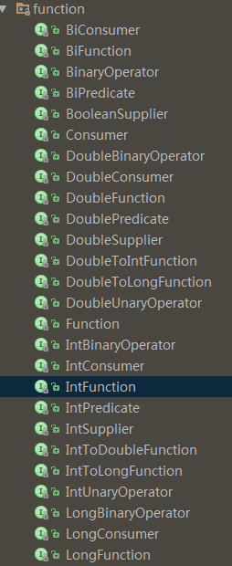

#Lambda
---
<h3>Outline</h3>

* [Lambda定义和结构](#1)
* [java.util.function（java8功能性接口）](#2)

---


<h3 id="1">一、Lambda定义和结构</h3>
#####Lambda表达式的定义：

	Java8引入Lambda表达式的目的是简化内部类的使用，其实质仍然是一个函数或者接口的实现。
	虽然称作Lambda表达式，但是不同于一般的可计算的表达式，Lambda表达式是一个接口（函数）的实现，也可以理解成匿名类的缩写。

*注：对于一个接口如果有多个未实现的方法，则不能使用Lambda表达式，可以有default和static方法方法*

#####基本结构：
    ( 形式参数 ) -> { 方法实现 }
形式参数的参数类型可以省去，编译器可以自动判断
e.g.
```java
Collections.sort(list, (x, y) -> y - x)
```
上面代码中的Lambda表达式：(x, y) -> y - x 实现的就是 java.util.Comparator 接口的
```int compare(T o1, T o2);```方法，虽然代码中没有显式指明，但是编译器会自动根据语法规则判断，并在编译成字节码时应用这些规则。


#####基本概念
方法引用
```
::  
```

接口默认方法，在实现接口时就不需要实现Default方法
```java
public interface IDefaultMethod {
    String getString();
    default int getInt(){
        return 1024;
    }
}
```

**编译器自动推导类型**
1. 接口类型
2. 方法参数类型
3. 方法返回值类型

如果不能推导出来那就需要开发者显示指出


<h3 id="2">二、java.util.function（java8功能性接口</h3>
java.util.function是java8中提供便于Lambda编程的接口，包内全部为接口
[<h3>api文档</h3>](https://docs.oracle.com/javase/8/docs/api/java/util/function/package-summary.html)

主要分为
1. Consumer（泛型输入，无输出）
```java
@FunctionalInterface
public interface Consumer<T> {

    /**
     * Performs this operation on the given argument.
     *
     * @param t the input argument
     */
    void accept(T t);

    /**
     * Returns a composed {@code Consumer} that performs, in sequence, this
     * operation followed by the {@code after} operation. If performing either
     * operation throws an exception, it is relayed to the caller of the
     * composed operation.  If performing this operation throws an exception,
     * the {@code after} operation will not be performed.
     *
     * @param after the operation to perform after this operation
     * @return a composed {@code Consumer} that performs in sequence this
     * operation followed by the {@code after} operation
     * @throws NullPointerException if {@code after} is null
     */
    default Consumer<T> andThen(Consumer<? super T> after) {
        Objects.requireNonNull(after);
        return (T t) -> { accept(t); after.accept(t); };
    }
}
```
2. Function（泛型输入，泛型输出）
```java
@FunctionalInterface
public interface Function<T, R> {
    
    R apply(T t);
   
    default <V> Function<V, R> compose(Function<? super V, ? extends T> before) {
        Objects.requireNonNull(before);
        return (V v) -> apply(before.apply(v));
    }
    
    default <V> Function<T, V> andThen(Function<? super R, ? extends V> after) {
        Objects.requireNonNull(after);
        return (T t) -> after.apply(apply(t));
    }
    
    static <T> Function<T, T> identity() {
        return t -> t;
    }
}
```
3. Supplier(无输入，泛型输出)
```java
@FunctionalInterface
public interface Supplier<T> {

    /**
     * Gets a result.
     *
     * @return a result
     */
    T get();
}
```

4. UnaryOperator(一元操作，输入一个T，返回一个T，因为继承Function)
```java
@FunctionalInterface
public interface UnaryOperator<T> extends Function<T, T> {

    /**
     * Returns a unary operator that always returns its input argument.
     *
     * @param <T> the type of the input and output of the operator
     * @return a unary operator that always returns its input argument
     */
    static <T> UnaryOperator<T> identity() {
        return t -> t;
    }
}
```
5. BinaryOperator(二元操作，输入两个T，返回一个T，因为继承BiFunction)
```java
@FunctionalInterface
public interface BinaryOperator<T> extends BiFunction<T,T,T> {
    /**
     * Returns a {@link BinaryOperator} which returns the lesser of two elements
     * according to the specified {@code Comparator}.
     *
     * @param <T> the type of the input arguments of the comparator
     * @param comparator a {@code Comparator} for comparing the two values
     * @return a {@code BinaryOperator} which returns the lesser of its operands,
     *         according to the supplied {@code Comparator}
     * @throws NullPointerException if the argument is null
     */
    public static <T> BinaryOperator<T> minBy(Comparator<? super T> comparator) {
        Objects.requireNonNull(comparator);
        return (a, b) -> comparator.compare(a, b) <= 0 ? a : b;
    }

    /**
     * Returns a {@link BinaryOperator} which returns the greater of two elements
     * according to the specified {@code Comparator}.
     *
     * @param <T> the type of the input arguments of the comparator
     * @param comparator a {@code Comparator} for comparing the two values
     * @return a {@code BinaryOperator} which returns the greater of its operands,
     *         according to the supplied {@code Comparator}
     * @throws NullPointerException if the argument is null
     */
    public static <T> BinaryOperator<T> maxBy(Comparator<? super T> comparator) {
        Objects.requireNonNull(comparator);
        return (a, b) -> comparator.compare(a, b) >= 0 ? a : b;
    }
}
```


扩展阅读
http://lucida.me/blog/java-8-lambdas-insideout-language-features/
